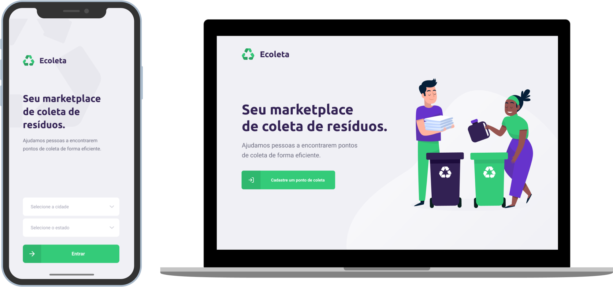

<h1 align="center">
    
</h1>

<h4 align="center">
  🚀 Projeto desenvolvido durante o evento: Next Level Week (NLW)
</h4>

  <a href="#rocket-tecnologias">Tecnologias</a>&nbsp;&nbsp;&nbsp;|&nbsp;&nbsp;&nbsp;
  <a href="#-projeto">Projeto</a>&nbsp;&nbsp;&nbsp;|&nbsp;&nbsp;&nbsp;
  <a href="#-layout">Layout</a>&nbsp;&nbsp;&nbsp;|&nbsp;&nbsp;&nbsp;

 

   

## :rocket: Tecnologias

Esse projeto foi desenvolvido com as seguintes tecnologias:

- [Node.js](https://nodejs.org/en/)
- [React](https://reactjs.org)
- [React Native](https://facebook.github.io/react-native/)
- [Expo](https://expo.io/)
- [TypeScript](https://www.typescriptlang.org/)

## 💻 Projeto

O Ecoletauma é uma aplicação direcionada para entidades(empresas) responsáveis por reciclar lixo, elas poderem criar e compartilhar seus pontos de coleta, além de especificar quais os itens de coleta um determinado ponto é responsável por efetuar a coleta.

## :wastebasket: Itens de coleta

Os itens de coleta pré-cadastrados são:

- Lâmpadas
- Pilhas e baterias
- Papeis e papelão
- Resíduos eletrônicos
- Resíduos orgânicos
- Óleo de cozinhas

## 🔖 Layout

Você pode visualizar o layout de todo o projeto no através [desse link](https://www.figma.com/file/urLinMAgmq75DuIiVRX6Sh/Ecoleta-(Booster)?node-id=30%3A0). Lembrando que você irá precisar ter uma conta no [Figma](http://figma.com/).

---

Desenvolvido por Yves Guilherme :rocket:
